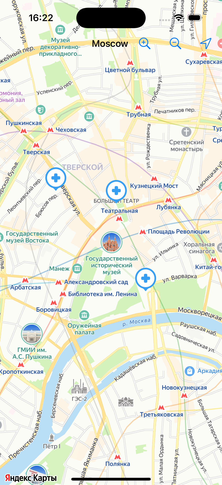
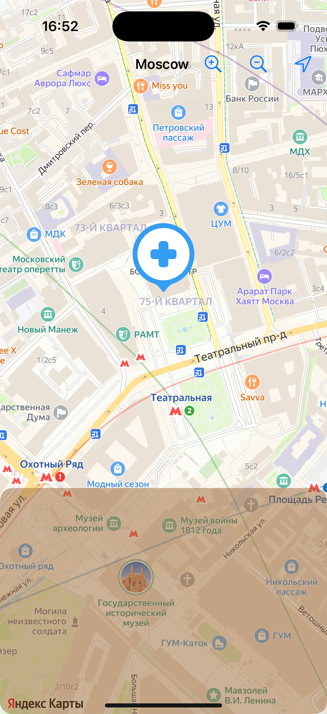

# YandexMapDemo
Demo project to show UI glitches and find ways to improve it

# Описание приложения
В данном приложении отображается карта. При старте карта показывает центр (псевдо положение пользователя в центре Москвы). Увеличение на первончальном отображении равно значению `14`. Дополнительно на карту нанесены объекты в количестве 3 штук (плейсмарки). Карта позволяет пользователю перемещаться, в навигационном баре добавлены кнопки: увеличения/уменьшения карты и возврату к геопозиции пользователя.

# Возможности
Пользователь может выбрать необходимый плейсмарк, нажав на него. 
1. У плейсмарка изменится картинка на бОльшую, внизу появится шторка (псевдо описание подробностей выбранного элемента).
2. Изменится увеличение карты до `16` единиц.
3. Камера "подъедет" на карте так, чтобы плейсмарк оказался в середине экрана, а потом сместится на расстояние равное нижней шторке.
4. Каждый раз, когда показывается шторка, ее высота берется в диапазоне `100-300` единиц. 
5. Тап по карте, смещение карты, тап по шторке или нажатие на кнопку перехода к пользовательскому гео приводит к предыдущему состоянию и выключает выбор плейсмарка пользователем. 

# Сложности в реализации
В случае, если карта отображается в значении зума не равном `16` (значение, которое используется для отображения выбранного плейсмарка), то, при показе выбора, необходимо сначала определить для карты зум, применить его. Потом центрировать карту на выбранной точке, после чего уже смещать точку согласно высоте показанной шторки.

# Этапы для показа проблем реализации
1. Уменьшить зум для карты (достаточно нажать на кнопку гео пользователя, карта перейдет в режим зума равному 14).
2. Нажать на один из плейсмарков.
3. Убедиться, что происходит изменение увеличения карты, а потом сдвиг по оси ординат.

https://github.com/user-attachments/assets/63510806-de77-4e7c-8257-c759b0fbcbda

